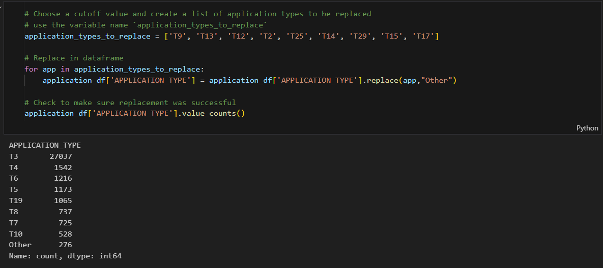

# Alphabet Soup Deep Learning Model Report

## Overview of the Analysis

The purpose of this analysis is to create a binary classifier using machine learning techniques, including neural networks, to assist in the prediction of successful funding applications for a nonprofit foundation named Alphabet Soup. This deep learning model aims to classify whether an applicant will be successful based on various features in the dataset therefore predicting the best chance of success.

## Results

### Data Preprocessing

- **Target Variable:**
  - Column `IS_SUCCESSFUL` -  which indicates if an applicant received funding

- **Features:**
  Columns included as featrues for the data set 
  - `APPLICATION_TYPE`
  - `AFFILIATION`
  - `CLASSIFICATION`
  - `USE_CASE`
  - `ORGANIZATION`
  - `STATUS`
  - `SPECIAL_CONSIDERATIONS`
  - `ASK_AMT`  

- **Removed Variables:**
  - Columns that do not contribute to the predictive model or are redundant are removed. These included unique identifiers such as `EIN` and `NAME`.  The `INCOME_AMT` column was removed to optimise the model, and was considered redundant to the success of applicant ventures.
  - `APPLICATION_TYPE` was identifed as a column were "rare" categorical variables could be combined to form a new value `Other`.

  - `CLASSIFICATION`was another column were "rare" categorical variables where identified and combined to form a new value `Other`
![]
 
### Compiling, Training, and Evaluating the Model

- **Neurons, Layers, and Activation Functions:**
  - The neural network was designed with several layers:
    - **First Layer:** 80 neurons, ReLU activation function.
    - **Second Layer:** 20 neurons, ReLU activation function.
    - **Third Layer:** 10 neurons, ReLU activation function.
    - **Output Layer:** 1 neuron, Sigmoid activation function.
  - ReLU is a popular choice for activation functions in deep learning models.  It adds non-linear functionality to the model.  As the model is a series of layers adding a non-linear function like ReLU to this type of data assists in enabling the training of more complex relationships in the data. The Sigmoid activation function is a common choice for the output layer, and is advantageous to the binary classificaiton nature of our data, and its superior interpretation of probability.

- **Model Performance:**
  - The final model achieved an accuracy of approximately **73.2%** on the test data, which is below the target accuracy of 75%.

- **Steps to Increase Model Performance:**
  - Various approaches were used to optimize the model, including:
    - Tuning the number of neurons and layers
      - I did not find that adding more than 3 layers was anymore beneficial
    - Experimenting with different activation functions
      - Adding the `Tanh`activation function to one of 3 layers had little to no effect on model accuracy or loss
    - Adjusting the number of epochs for training
      - Increasing the number of epochs had an affect when I increase the `.value_counts` number of the loan `CLASSIFICATIONS` to `<=70` per `CLASSIFICATION`
  - Despite these efforts, the accuracy remained slightly below the target

## Summary

The deep learning model created for predicting the success of funding applications achieved an accuracy of 73.2%, which is close to, but below the desired threshold. A suggestion may be that, while the model captures some underlying patterns in the data, it may not be fully optimised.

**Recommendation:**
To improve performance, it may be beneficial to explore alternative machine learning models such as Random Forests, Gradient Boosting Machines, or Support Vector Machines. Using these models may be able to capture the complex patterns in the data that the current deep learning model has not. Additionally, further feature engineering, hyperparameter tuning, or the use of more sophisticated neural network architectures could also be explored to improve the model's accuracy.
